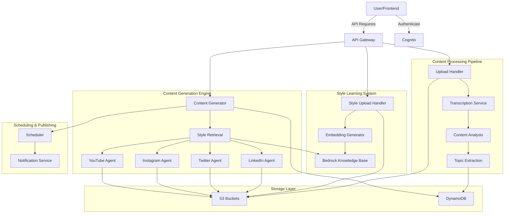

# Design Document: AI-Powered Content Repurposing Platform

## Overview

The AI-Powered Content Repurposing Platform is a serverless, event-driven system built on AWS that transforms long-form content into platform-optimized social media posts while preserving the creator's unique voice. The system leverages Amazon Bedrock for AI capabilities, implements RAG-based style mimicry, and provides a scalable architecture for content processing and generation.

### Core Design Principles

1. **Serverless-First**: Utilize AWS Lambda for compute, eliminating server management and enabling automatic scaling
2. **Event-Driven Architecture**: Decouple components using EventBridge and SQS for asynchronous processing
3. **RAG-Based Style Learning**: Use vector embeddings and semantic search to capture and replicate user writing style
4. **Platform Specialization**: Dedicated agents for each social media platform with specific formatting rules
5. **Graceful Degradation**: Handle failures at each stage with retries, error messages, and state preservation

### Technology Stack

- **Compute**: AWS Lambda (Python 3.11)
- **AI/ML**: Amazon Bedrock (Claude Sonnet 3.5, Titan Embeddings)
- **Storage**: Amazon S3 (content files), DynamoDB (metadata)
- **Vector Search**: Amazon Bedrock Knowledge Base
- **Transcription**: Amazon Transcribe
- **Authentication**: Amazon Cognito
- **API**: API Gateway (REST)
- **Orchestration**: AWS Step Functions
- **Messaging**: EventBridge, SQS
- **Monitoring**: CloudWatch

## Architecture

### High-Level Architecture



### Data Flow

1. **Style Learning Flow**:
   - User uploads past content → S3 Style Vault
   - Lambda generates embeddings via Titan
   - Embeddings stored in Bedrock Knowledge Base
   - Style profile marked ready

2. **Content Repurposing Flow**:
   - User uploads content → S3
   - Transcribe converts audio/video → text
   - Claude extracts topics → DynamoDB
   - User selects platforms
   - System retrieves style patterns from KB
   - Platform agents generate content
   - Generated content stored in S3 + DynamoDB

3. **Scheduling Flow**:
   - User schedules post → DynamoDB
   - EventBridge triggers at scheduled time
   - Notification sent to user

## Components and Interfaces

### 1. Authentication Service

**Responsibility**: User authentication and authorization

**Interface**:
```python
class AuthenticationService:
    def register_user(email: str, password: str) -> UserProfile:
        """
        Register a new user account
        Returns: UserProfile with user_id and metadata
        Raises: ValidationError if email/password invalid
        """
        pass
    
    def authenticate(email: str, password: str) -> AuthToken:
        """
        Authenticate user and return JWT token
        Returns: AuthToken with access_token and expiry
        Raises: AuthenticationError if credentials invalid
        """
        pass
    
    def verify_token(token: str) -> UserProfile:
        """
        Verify JWT token and return user profile
        Returns: UserProfile if token valid
        Raises: AuthenticationError if token invalid/expired
        """
        pass
```

**Implementation Notes**:
- Uses Amazon Cognito User Pools
- JWT tokens with 1-hour expiry
- Refresh tokens for extended sessions

### 2. Style Profile Manager

**Responsibility**: Manage user style content and generate style profiles

**Interface**:
```python
class StyleProfileManager:
    def upload_style_content(
        user_id: str,
        file: BinaryIO,
        filename: str,
        content_type: str
    ) -> StyleContentMetadata:
        """
        Upload style content to Style Vault
        Returns: StyleContentMetadata with content_id and status
        Raises: ValidationError if file type unsupported
        """
        pass
    
    def generate_embeddings(user_id: str, content_id: str) -> EmbeddingResult:
        """
        Generate embeddings for style content using Titan
        Returns: EmbeddingResult with embedding_id and vector dimensions
        Raises: EmbeddingError if generation fails
        """
        pass
    
    def get_style_profile(user_id: str) -> StyleProfile:
        """
        Retrieve user's style profile
        Returns: StyleProfile with status and content count
        Raises: NotFoundError if profile doesn't exist
        """
        pass
    
    def is_profile_ready(user_id: str) -> bool:
        """
        Check if style profile has sufficient content (>= 3 pieces)
        Returns: True if ready, False otherwise
        """
        pass
```

**Implementation Notes**:
- Stores files in S3 bucket: `style-vault-{user_id}/`
- Generates embeddings using Amazon Titan Embeddings G1
- Stores embeddings in Bedrock Knowledge Base with user_id metadata
- Minimum 3 style content pieces for profile readiness

### 3. Content Upload Handler

**Responsibility**: Handle content uploads and initiate transcription

**Interface**:
```python
class ContentUploadHandler:
    def upload_content(
        user_id: str,
        file: BinaryIO,
        filename: str,
        content_type: str
    ) -> ContentMetadata:
        """
        Upload original content and initiate processing
        Returns: ContentMetadata with content_id and processing status
        Raises: ValidationError if file type unsupported
        """
        pass
    
    def get_upload_status(content_id: str) -> ProcessingStatus:
        """
        Get current processing status of uploaded content
        Returns: ProcessingStatus with stage and progress percentage
        """
        pass
```

**Supported Formats**:
- Video: MP4, MOV, AVI
- Audio: MP3, WAV
- Text: TXT, MD, PDF

**Implementation Notes**:
- Stores files in S3 bucket: `original-content-{user_id}/`
- Triggers Step Functions workflow for processing
- Returns immediately with content_id for async tracking

### 4. Transcription Service

**Responsibility**: Convert audio/video to text using Amazon Transcribe

**Interface**:
```python
class TranscriptionService:
    def start_transcription(
        content_id: str,
        s3_uri: str,
        media_format: str
    ) -> TranscriptionJob:
        """
        Start transcription job for audio/video content
        Returns: TranscriptionJob with job_id and status
        Raises: TranscriptionError if job creation fails
        """
        pass
    
    def get_transcription_result(job_id: str) -> Transcription:
        """
        Retrieve completed transcription
        Returns: Transcription with text and timestamps
        Raises: NotFoundError if job doesn't exist
        """
        pass
    
    def get_progress(job_id: str) -> TranscriptionProgress:
        """
        Get transcription progress
        Returns: TranscriptionProgress with percentage and estimated time
        """
        pass
```

**Implementation Notes**:
- Uses Amazon Transcribe with automatic language detection
- Generates timestamped transcripts for video editing feature
- Stores transcripts in S3: `transcripts-{user_id}/{content_id}.json`
- Implements retry logic (3 attempts) for failed jobs

### 5. Content Analyzer

**Responsibility**: Extract topics and key points from content

**Interface**:
```python
class ContentAnalyzer:
    def extract_topics(
        content_id: str,
        transcript: str
    ) -> TopicExtractionResult:
        """
        Extract 5-15 main topics from content using Claude
        Returns: TopicExtractionResult with topics and confidence scores
        Raises: InsufficientContentError if content too short
        """
        pass
    
    def analyze_content_structure(transcript: str) -> ContentStructure:
        """
        Analyze content structure (intro, body, conclusion)
        Returns: ContentStructure with sections and timestamps
        """
        pass
```

**Implementation Notes**:
- Uses Claude Sonnet 3.5 via Bedrock
- Minimum content length: 500 words
- Extracts 5-15 topics with relevance scores
- Stores topics in DynamoDB with content_id

### 6. Style Retrieval Service

**Responsibility**: Retrieve relevant style patterns using RAG

**Interface**:
```python
class StyleRetrievalService:
    def retrieve_style_patterns(
        user_id: str,
        content_embedding: List[float]
    ) -> StylePatterns:
        """
        Retrieve top 3 most similar style content pieces
        Returns: StylePatterns with examples and characteristics
        Raises: NoStyleProfileError if user has no style content
        """
        pass
    
    def extract_writing_characteristics(
        style_content: List[str]
    ) -> WritingCharacteristics:
        """
        Extract writing style characteristics from retrieved content
        Returns: WritingCharacteristics with tone, vocabulary, structure
        """
        pass
```

**Implementation Notes**:
- Queries Bedrock Knowledge Base with content embedding
- Retrieves top 3 most similar documents (k=3)
- Extracts characteristics: sentence structure, vocabulary, emoji usage, tone
- Caches results for 5 minutes to reduce API calls

### 7. Platform Agent Factory

**Responsibility**: Create platform-specific content generation agents

**Interface**:
```python
class PlatformAgentFactory:
    def create_agent(platform: Platform) -> PlatformAgent:
        """
        Create platform-specific agent
        Returns: PlatformAgent configured for the platform
        Raises: UnsupportedPlatformError if platform not supported
        """
        pass

class PlatformAgent(ABC):
    @abstractmethod
    def generate_content(
        topics: List[str],
        style_patterns: StylePatterns,
        original_content: str
    ) -> GeneratedContent:
        """
        Generate platform-optimized content
        Returns: GeneratedContent with text and metadata
        """
        pass
    
    @abstractmethod
    def validate_content(content: str) -> ValidationResult:
        """
        Validate content meets platform requirements
        Returns: ValidationResult with errors and warnings
        """
        pass
```

### 8. LinkedIn Agent

**Responsibility**: Generate LinkedIn-optimized posts

**Specifications**:
- Length: 150-250 words
- Format: Hook + body + discussion prompt
- Tone: Professional, thought-provoking
- Structure: 3-5 short paragraphs

**Implementation**:
```python
class LinkedInAgent(PlatformAgent):
    def generate_content(
        topics: List[str],
        style_patterns: StylePatterns,
        original_content: str
    ) -> GeneratedContent:
        """
        Generate LinkedIn post with hook and discussion prompt
        """
        prompt = self._build_prompt(topics, style_patterns, original_content)
        response = bedrock_client.invoke_model(
            modelId="anthropic.claude-3-5-sonnet-20241022-v2:0",
            body={
                "anthropic_version": "bedrock-2023-05-31",
                "max_tokens": 1000,
                "temperature": 0.7,
                "messages": [{"role": "user", "content": prompt}]
            }
        )
        return self._parse_response(response)
    
    def _build_prompt(self, topics, style_patterns, original_content) -> str:
        """Build LinkedIn-specific prompt with style examples"""
        pass
```

### 9. Twitter Agent

**Responsibility**: Generate Twitter thread

**Specifications**:
- Format: 5-7 tweet thread
- Length: Each tweet < 280 characters
- Structure: Hook tweet + supporting tweets + CTA
- Style: Concise, engaging, numbered

**Implementation**:
```python
class TwitterAgent(PlatformAgent):
    MAX_TWEET_LENGTH = 280
    MIN_TWEETS = 5
    MAX_TWEETS = 7
    
    def generate_content(
        topics: List[str],
        style_patterns: StylePatterns,
        original_content: str
    ) -> GeneratedContent:
        """
        Generate Twitter thread with 5-7 tweets
        """
        prompt = self._build_prompt(topics, style_patterns, original_content)
        response = bedrock_client.invoke_model(
            modelId="anthropic.claude-3-5-sonnet-20241022-v2:0",
            body={
                "anthropic_version": "bedrock-2023-05-31",
                "max_tokens": 1500,
                "temperature": 0.7,
                "messages": [{"role": "user", "content": prompt}]
            }
        )
        tweets = self._parse_thread(response)
        return self._validate_thread(tweets)
    
    def _validate_thread(self, tweets: List[str]) -> GeneratedContent:
        """Ensure each tweet is under 280 characters"""
        for i, tweet in enumerate(tweets):
            if len(tweet) > self.MAX_TWEET_LENGTH:
                raise ValidationError(f"Tweet {i+1} exceeds 280 characters")
        return GeneratedContent(content=tweets, platform="twitter")
```

### 10. Instagram Agent

**Responsibility**: Generate Instagram caption

**Specifications**:
- Length: 100-150 words
- Format: Story-driven with emojis
- Structure: Hook + story + CTA
- Style: Casual, visual, emoji-rich

**Implementation**:
```python
class InstagramAgent(PlatformAgent):
    MIN_WORDS = 100
    MAX_WORDS = 150
    
    def generate_content(
        topics: List[str],
        style_patterns: StylePatterns,
        original_content: str
    ) -> GeneratedContent:
        """
        Generate Instagram caption with emojis and story
        """
        prompt = self._build_prompt(topics, style_patterns, original_content)
        response = bedrock_client.invoke_model(
            modelId="anthropic.claude-3-5-sonnet-20241022-v2:0",
            body={
                "anthropic_version": "bedrock-2023-05-31",
                "max_tokens": 800,
                "temperature": 0.7,
                "messages": [{"role": "user", "content": prompt}]
            }
        )
        return self._parse_response(response)
```

### 11. YouTube Shorts Agent

**Responsibility**: Generate YouTube Shorts script

**Specifications**:
- Duration: 30-60 seconds
- Format: Timestamped script with visual cues
- Structure: Hook (0-3s) + content (3-55s) + CTA (55-60s)
- Style: Fast-paced, visual directions included

**Implementation**:
```python
class YouTubeShortsAgent(PlatformAgent):
    MIN_DURATION = 30
    MAX_DURATION = 60
    
    def generate_content(
        topics: List[str],
        style_patterns: StylePatterns,
        original_content: str
    ) -> GeneratedContent:
        """
        Generate YouTube Shorts script with timestamps and visual cues
        """
        prompt = self._build_prompt(topics, style_patterns, original_content)
        response = bedrock_client.invoke_model(
            modelId="anthropic.claude-3-5-sonnet-20241022-v2:0",
            body={
                "anthropic_version": "bedrock-2023-05-31",
                "max_tokens": 1200,
                "temperature": 0.7,
                "messages": [{"role": "user", "content": prompt}]
            }
        )
        return self._parse_script(response)
    
    def _parse_script(self, response) -> GeneratedContent:
        """Parse script with timestamps and visual cues"""
        pass
```

### 12. Content Generator Orchestrator

**Responsibility**: Orchestrate multi-platform content generation

**Interface**:
```python
class ContentGeneratorOrchestrator:
    def generate_for_platforms(
        user_id: str,
        content_id: str,
        platforms: List[Platform]
    ) -> Dict[Platform, GeneratedContent]:
        """
        Generate content for multiple platforms in parallel
        Returns: Dictionary mapping platform to generated content
        Raises: GenerationError if any platform fails
        """
        pass
    
    def regenerate_content(
        user_id: str,
        content_id: str,
        platform: Platform,
        seed: Optional[int] = None
    ) -> GeneratedContent:
        """
        Regenerate content with different seed for variation
        Returns: New GeneratedContent instance
        """
        pass
```

**Implementation Notes**:
- Uses ThreadPoolExecutor for parallel generation
- Timeout: 15 seconds per platform
- Stores all versions for comparison
- Uses different random seeds for regeneration

### 13. SEO Optimizer

**Responsibility**: Generate titles, hashtags, and alt-text

**Interface**:
```python
class SEOOptimizer:
    def generate_titles(
        content: str,
        topics: List[str]
    ) -> List[str]:
        """
        Generate 5 title variants using different approaches
        Returns: List of 5 titles (curiosity, benefit, listicle, question, statement)
        """
        pass
    
    def generate_hashtags(
        content: str,
        platform: Platform,
        topics: List[str]
    ) -> List[str]:
        """
        Generate 4-8 platform-specific hashtags
        Returns: List of hashtags with # prefix
        """
        pass
    
    def generate_alt_text(image_description: str) -> str:
        """
        Generate descriptive alt-text for accessibility
        Returns: Alt-text string (max 125 characters)
        """
        pass
```

**Implementation Notes**:
- Title approaches: curiosity, benefit, listicle, question, statement
- Hashtag count: 4-8 per platform
- Twitter: trending hashtags prioritized
- Instagram: high-engagement hashtags prioritized
- Alt-text: max 125 characters for accessibility

### 14. Scheduler Service

**Responsibility**: Schedule posts and send notifications

**Interface**:
```python
class SchedulerService:
    def schedule_post(
        user_id: str,
        content_id: str,
        platform: Platform,
        scheduled_time: datetime
    ) -> ScheduledPost:
        """
        Schedule post for future publication
        Returns: ScheduledPost with schedule_id
        Raises: ValidationError if time is in the past
        """
        pass
    
    def get_optimal_times(platform: Platform) -> List[datetime]:
        """
        Get recommended posting times for platform
        Returns: List of 3 optimal times for next 7 days
        """
        pass
    
    def cancel_schedule(schedule_id: str) -> bool:
        """
        Cancel scheduled post
        Returns: True if cancelled, False if already published
        """
        pass
```

**Optimal Posting Times** (based on platform best practices):
- LinkedIn: Tue-Thu, 8-10 AM, 12 PM
- Twitter: Mon-Fri, 9 AM, 12 PM, 5 PM
- Instagram: Mon-Fri, 11 AM, 2 PM, 7 PM
- YouTube: Thu-Sat, 2-4 PM

**Implementation Notes**:
- Stores schedules in DynamoDB
- Uses EventBridge rules for triggering
- Sends notifications via SNS

### 15. Content Library Service

**Responsibility**: Manage content storage and retrieval

**Interface**:
```python
class ContentLibraryService:
    def get_user_content(
        user_id: str,
        limit: int = 50,
        offset: int = 0
    ) -> ContentList:
        """
        Retrieve user's content library sorted by creation date
        Returns: ContentList with items and pagination info
        """
        pass
    
    def get_content_details(content_id: str) -> ContentDetails:
        """
        Get detailed information about specific content
        Returns: ContentDetails with all metadata and generated versions
        """
        pass
    
    def delete_content(content_id: str) -> bool:
        """
        Delete content and all associated data
        Returns: True if deleted successfully
        """
        pass
```

**Implementation Notes**:
- Queries DynamoDB GSI on user_id
- Sorts by creation_date descending
- Soft delete: marks as deleted, preserves data
- Hard delete after 30 days

## Data Models

### User Profile

```python
@dataclass
class UserProfile:
    user_id: str  # UUID
    email: str
    created_at: datetime
    style_profile_status: StyleProfileStatus  # INCOMPLETE, READY
    style_content_count: int
    subscription_tier: str  # FREE, PRO, ENTERPRISE
```

**DynamoDB Table**: `users`
- Partition Key: `user_id`
- Attributes: email, created_at, style_profile_status, style_content_count, subscription_tier

### Style Content Metadata

```python
@dataclass
class StyleContentMetadata:
    content_id: str  # UUID
    user_id: str
    filename: str
    s3_uri: str
    content_type: str
    uploaded_at: datetime
    embedding_id: Optional[str]
    embedding_status: EmbeddingStatus  # PENDING, COMPLETED, FAILED
```

**DynamoDB Table**: `style_content`
- Partition Key: `user_id`
- Sort Key: `content_id`
- GSI: `embedding_status-index` for querying by status

### Original Content Metadata

```python
@dataclass
class ContentMetadata:
    content_id: str  # UUID
    user_id: str
    filename: str
    s3_uri: str
    content_type: str  # video/mp4, audio/mp3, text/plain
    uploaded_at: datetime
    processing_status: ProcessingStatus  # UPLOADED, TRANSCRIBING, ANALYZING, READY, FAILED
    transcription_job_id: Optional[str]
    transcript_s3_uri: Optional[str]
    topics: Optional[List[str]]
    duration_seconds: Optional[int]  # For video/audio
```

**DynamoDB Table**: `original_content`
- Partition Key: `user_id`
- Sort Key: `content_id`
- GSI: `processing_status-index` for monitoring

### Generated Content

```python
@dataclass
class GeneratedContent:
    generation_id: str  # UUID
    content_id: str  # Reference to original content
    user_id: str
    platform: Platform  # LINKEDIN, TWITTER, INSTAGRAM, YOUTUBE_SHORTS
    content_text: str  # JSON for Twitter threads, plain text for others
    seo_metadata: SEOMetadata
    generated_at: datetime
    version: int  # For regenerations
    s3_uri: str
    status: ContentStatus  # DRAFT, APPROVED, SCHEDULED, PUBLISHED
```

**DynamoDB Table**: `generated_content`
- Partition Key: `content_id`
- Sort Key: `generation_id`
- GSI: `user_id-generated_at-index` for user library

### SEO Metadata

```python
@dataclass
class SEOMetadata:
    titles: List[str]  # 5 variants
    hashtags: List[str]  # 4-8 hashtags
    alt_text: Optional[str]
```

### Scheduled Post

```python
@dataclass
class ScheduledPost:
    schedule_id: str  # UUID
    user_id: str
    generation_id: str
    platform: Platform
    scheduled_time: datetime
    created_at: datetime
    status: ScheduleStatus  # PENDING, NOTIFIED, CANCELLED
    notification_sent: bool
```

**DynamoDB Table**: `scheduled_posts`
- Partition Key: `user_id`
- Sort Key: `schedule_id`
- GSI: `scheduled_time-index` for EventBridge queries

### Style Profile

```python
@dataclass
class StyleProfile:
    user_id: str
    status: StyleProfileStatus  # INCOMPLETE, READY
    content_count: int
    last_updated: datetime
    knowledge_base_id: str
```

### Enums

```python
class Platform(Enum):
    LINKEDIN = "linkedin"
    TWITTER = "twitter"
    INSTAGRAM = "instagram"
    YOUTUBE_SHORTS = "youtube_shorts"

class ProcessingStatus(Enum):
    UPLOADED = "uploaded"
    TRANSCRIBING = "transcribing"
    ANALYZING = "analyzing"
    READY = "ready"
    FAILED = "failed"

class StyleProfileStatus(Enum):
    INCOMPLETE = "incomplete"
    READY = "ready"

class ContentStatus(Enum):
    DRAFT = "draft"
    APPROVED = "approved"
    SCHEDULED = "scheduled"
    PUBLISHED = "published"

class ScheduleStatus(Enum):
    PENDING = "pending"
    NOTIFIED = "notified"
    CANCELLED = "cancelled"
```

## Correctness Properties

*A property is a characteristic or behavior that should hold true across all valid executions of a system—essentially, a formal statement about what the system should do. Properties serve as the bridge between human-readable specifications and machine-verifiable correctness guarantees.*

Before defining the correctness properties, I'll analyze each acceptance criterion for testability.


### Property Reflection

After analyzing all acceptance criteria, I've identified the following redundancies and consolidations:

**Redundancies Identified**:
1. Properties 1.3, 2.2, 5.7 all test round-trip storage (upload → retrieve) - can be consolidated into one comprehensive storage property
2. Properties 1.4 and 1.5 both test embedding generation and storage - can be combined into one property about embedding lifecycle
3. Properties 2.4, 3.3, 7.6 all test metadata association - can be consolidated into one property about metadata integrity
4. Properties 4.1 and 4.5 both test that style patterns are used in generation - can be combined
5. Properties 5.2, 5.3, 5.4, 5.5 all test platform-specific constraints - keep separate as each validates unique platform rules
6. Properties 10.2 and 10.3 both test metadata storage and retrieval - can be combined into one property

**Properties to Keep Separate** (provide unique validation):
- Platform-specific generation constraints (5.2-5.5) - each validates different platform rules
- Error handling properties (11.1-11.6) - each tests different error scenarios
- Input validation properties (1.2, 2.1) - test different file type sets

**Consolidated Properties**:
- Storage round-trip: Any uploaded content should be retrievable with identical data
- Embedding lifecycle: Style content should generate embeddings that are queryable by user_id
- Metadata integrity: All generated artifacts should have associated metadata with required fields
- Style pattern usage: Content generation should query and use style patterns from Knowledge Base

### Correctness Properties

Property 1: User profile creation
*For any* valid user credentials, when a user creates an account, the system should create a user profile with user_id, email, created_at, and style_profile_status fields.
**Validates: Requirements 1.1**

Property 2: Style content file type acceptance
*For any* file with extension in {.txt, .md, .pdf, .doc, .docx}, the system should accept it as valid style content.
**Validates: Requirements 1.2**

Property 3: Content storage round-trip
*For any* uploaded content (style content, original content, or generated content), retrieving it from storage should return data identical to what was uploaded.
**Validates: Requirements 1.3, 2.2, 5.7**

Property 4: Embedding lifecycle completeness
*For any* style content stored in the Style Vault, the system should generate embeddings with correct dimensions (1536 for Titan) and store them in the Knowledge Base queryable by user_id.
**Validates: Requirements 1.4, 1.5**

Property 5: Style profile readiness state transition
*For any* user with style content, when processing completes successfully, the style_profile_status should transition to READY.
**Validates: Requirements 1.6**

Property 6: Original content file type acceptance
*For any* file with extension in {.mp4, .mov, .avi, .mp3, .wav, .txt, .md, .pdf}, the system should accept it as valid original content.
**Validates: Requirements 2.1**

Property 7: Transcription job creation for media files
*For any* uploaded file with media type (video or audio), the system should create a transcription job and eventually produce a transcript.
**Validates: Requirements 2.3**

Property 8: Text file direct processing
*For any* uploaded text file, the system should extract content directly without creating a transcription job.
**Validates: Requirements 2.5**

Property 9: Upload failure error handling
*For any* invalid file upload (unsupported type, corrupted file, too large), the system should return a descriptive error and maintain consistent state (no partial uploads).
**Validates: Requirements 2.6**

Property 10: Processing status updates
*For any* content being processed, the processing_status field should progress through valid state transitions (UPLOADED → TRANSCRIBING → ANALYZING → READY or FAILED).
**Validates: Requirements 2.7**

Property 11: Topic extraction from transcripts
*For any* transcript with sufficient content (≥500 words), the system should extract topics using Claude and store them with the content metadata.
**Validates: Requirements 3.1, 3.3**

Property 12: Topic count constraints
*For any* content with extracted topics, the number of topics should be between 5 and 15 inclusive.
**Validates: Requirements 3.2**

Property 13: Topics accessibility
*For any* content with completed topic extraction, the topics should be retrievable via the API in the content details response.
**Validates: Requirements 3.5**

Property 14: Style pattern retrieval and usage
*For any* content generation request, the system should query the Knowledge Base with the content embedding and include the top 3 most similar style patterns in the generation prompt.
**Validates: Requirements 4.1, 4.2, 4.5**

Property 15: Writing characteristics extraction
*For any* retrieved style patterns, the system should extract writing characteristics including sentence_structure, vocabulary, emoji_usage, and tone fields.
**Validates: Requirements 4.3**

Property 16: LinkedIn content constraints
*For any* LinkedIn content generation, the output should be between 150-250 words and contain a hook and discussion prompt.
**Validates: Requirements 5.2**

Property 17: Twitter thread constraints
*For any* Twitter content generation, the output should be a thread of 5-7 tweets where each tweet is ≤280 characters.
**Validates: Requirements 5.3**

Property 18: Instagram caption constraints
*For any* Instagram content generation, the output should be between 100-150 words and contain at least one emoji.
**Validates: Requirements 5.4**

Property 19: YouTube Shorts script constraints
*For any* YouTube Shorts content generation, the output should be a timestamped script with duration between 30-60 seconds and include visual cues.
**Validates: Requirements 5.5**

Property 20: Bedrock model configuration
*For any* content generation request, the system should invoke Claude Sonnet 3.5 via Bedrock with temperature parameter set to 0.7.
**Validates: Requirements 5.6**

Property 21: Generation error recovery
*For any* failed content generation, the system should return an error message and maintain the system in a state that allows retry without data loss.
**Validates: Requirements 5.8**

Property 22: Regeneration input consistency
*For any* content regeneration request, the system should use the same content_id and style patterns as the original generation.
**Validates: Requirements 6.1**

Property 23: Regeneration output variation
*For any* two regeneration requests for the same content and platform, the outputs should be different (different random seeds produce different results).
**Validates: Requirements 6.2**

Property 24: Version history preservation
*For any* content with multiple regenerations, all versions should be stored with incrementing version numbers and all should be retrievable.
**Validates: Requirements 6.4**

Property 25: Title variant generation
*For any* SEO optimization request, the system should generate exactly 5 title variants using different approaches (curiosity, benefit, listicle, question, statement).
**Validates: Requirements 7.1**

Property 26: Hashtag count constraints
*For any* hashtag generation request, the system should generate between 4 and 8 hashtags inclusive.
**Validates: Requirements 7.2**

Property 27: Alt-text generation
*For any* image description provided, the system should generate non-empty alt-text with length ≤125 characters.
**Validates: Requirements 7.3**

Property 28: Twitter hashtag format validation
*For any* hashtags generated for Twitter, each hashtag should start with '#' and contain no spaces.
**Validates: Requirements 7.4**

Property 29: SEO metadata association
*For any* generated content, the SEO metadata (titles, hashtags, alt_text) should be stored with the content and retrievable together.
**Validates: Requirements 7.6**

Property 30: Optimal time recommendations
*For any* platform, when optimal posting times are requested, the system should return at least 3 recommended times in the future based on platform best practices.
**Validates: Requirements 8.2**

Property 31: Schedule storage completeness
*For any* scheduled post, the system should store all required fields (user_id, generation_id, platform, scheduled_time, status) in DynamoDB.
**Validates: Requirements 8.3**

Property 32: Scheduled notification queuing
*For any* post scheduled for a future time, when that time arrives, a notification should be queued for the user.
**Validates: Requirements 8.4**

Property 33: Scheduling error handling
*For any* invalid schedule request (time in past, invalid platform), the system should return an error and not create a schedule entry.
**Validates: Requirements 8.5**

Property 34: Content editing persistence
*For any* generated content, when a user edits it, retrieving the content should return the edited version.
**Validates: Requirements 9.2**

Property 35: Content approval state transition
*For any* generated content, when a user approves it, the status should transition to APPROVED.
**Validates: Requirements 9.3**

Property 36: Platform limit validation
*For any* generated content that exceeds platform limits (character count, word count), the system should return a validation warning.
**Validates: Requirements 9.5**

Property 37: S3 encryption at rest
*For any* content uploaded to S3, the object metadata should indicate encryption at rest is enabled.
**Validates: Requirements 10.1**

Property 38: Metadata completeness
*For any* created content metadata, it should contain all required fields: user_id, content_id, created_at, and status.
**Validates: Requirements 10.2**

Property 39: User content isolation
*For any* user requesting their content library, the system should return only content associated with that user_id and no other user's content.
**Validates: Requirements 10.3**

Property 40: Content library sort order
*For any* content library retrieval, results should be sorted by creation_date in descending order (newest first).
**Validates: Requirements 10.4**

Property 41: Content deletion completeness
*For any* content deletion request, the S3 object should be removed and the DynamoDB metadata should be marked as deleted.
**Validates: Requirements 10.5**

Property 42: Upload failure error specificity
*For any* file upload failure, the error message should indicate the specific failure reason (unsupported type, file too large, network error, etc.).
**Validates: Requirements 11.1**

Property 43: Transcription retry logic
*For any* failed transcription job, the system should retry exactly 3 times before returning a final error.
**Validates: Requirements 11.2**

Property 44: External service unavailability handling
*For any* request when Amazon Bedrock is unavailable, the system should return an error indicating temporary unavailability without corrupting data.
**Validates: Requirements 11.3**

Property 45: Rate limit error information
*For any* rate limit exceeded error, the response should include retry-after timing information.
**Validates: Requirements 11.4**

Property 46: Error logging
*For any* error that occurs during processing, an error log entry should be created with timestamp, error type, and context details.
**Validates: Requirements 11.5**

Property 47: Processing interruption recovery
*For any* interrupted processing operation, the system should maintain data consistency and allow the operation to be resumed or retried without data loss.
**Validates: Requirements 11.6**

Property 48: Parallel platform generation
*For any* content generation request with multiple platforms, the system should process platforms in parallel (concurrent execution).
**Validates: Requirements 12.3**

Property 49: Transcript edit tracking
*For any* transcript edit, the system should record the change with before and after states.
**Validates: Requirements 13.1**

Property 50: Transcript edit timestamp mapping
*For any* saved transcript edit, the system should map the edit to video timestamp ranges.
**Validates: Requirements 13.2**

Property 51: FFmpeg video cutting
*For any* video cutting request, the system should invoke FFmpeg with correct parameters based on transcript edit timestamps.
**Validates: Requirements 13.3**

Property 52: Edited video storage
*For any* completed video edit, the edited video should be stored in S3 and retrievable.
**Validates: Requirements 13.4**

Property 53: Video editing failure preservation
*For any* failed video editing operation, the original video should remain unchanged and accessible.
**Validates: Requirements 13.5**

## Error Handling

### Error Categories

1. **Validation Errors** (4xx)
   - Invalid file types
   - Missing required fields
   - Content exceeds platform limits
   - Invalid schedule times (past dates)

2. **Authentication Errors** (401, 403)
   - Invalid credentials
   - Expired tokens
   - Insufficient permissions

3. **Resource Not Found** (404)
   - Content ID doesn't exist
   - User has no style profile
   - Schedule ID not found

4. **External Service Errors** (502, 503)
   - Amazon Transcribe failures
   - Amazon Bedrock unavailable
   - S3 access errors

5. **Rate Limiting** (429)
   - Too many requests
   - Bedrock throttling
   - API Gateway limits

6. **Processing Errors** (500)
   - Transcription failures after retries
   - Topic extraction failures
   - Content generation failures

### Error Response Format

```python
@dataclass
class ErrorResponse:
    error_code: str  # Machine-readable code
    message: str  # Human-readable message
    details: Optional[Dict[str, Any]]  # Additional context
    retry_after: Optional[int]  # Seconds to wait before retry
    request_id: str  # For debugging
```

### Retry Strategies

1. **Transcription Jobs**: 3 retries with exponential backoff (1s, 2s, 4s)
2. **Bedrock API Calls**: 2 retries with exponential backoff (500ms, 1s)
3. **S3 Operations**: 3 retries with exponential backoff (100ms, 200ms, 400ms)
4. **DynamoDB Operations**: 3 retries with exponential backoff (100ms, 200ms, 400ms)

### Error Logging

All errors logged to CloudWatch with:
- Timestamp
- Error type and code
- User ID (if available)
- Content ID (if applicable)
- Stack trace
- Request context

### Graceful Degradation

1. **Style Profile Incomplete**: Allow content generation with generic style
2. **Topic Extraction Failure**: Allow manual topic input
3. **SEO Generation Failure**: Return content without SEO metadata
4. **Scheduling Failure**: Allow immediate posting as fallback

## Testing Strategy

### Dual Testing Approach

This system requires both unit tests and property-based tests for comprehensive coverage:

**Unit Tests**: Focus on specific examples, edge cases, and integration points
- Authentication flows with valid/invalid credentials
- File upload with specific file types
- Platform-specific content generation examples
- Error handling for specific failure scenarios
- API endpoint integration tests

**Property-Based Tests**: Verify universal properties across all inputs
- Storage round-trip for any content
- Platform constraint validation for any generated content
- Metadata integrity for any created resource
- Error handling preserves state for any failure
- Style pattern retrieval for any user with profile

### Property-Based Testing Configuration

**Framework**: Use `hypothesis` for Python
**Configuration**:
- Minimum 100 iterations per property test
- Each test tagged with: `Feature: content-repurposing-platform, Property {N}: {property_text}`
- Custom generators for domain objects (UserProfile, ContentMetadata, etc.)

**Example Property Test Structure**:
```python
from hypothesis import given, strategies as st
import pytest

@given(
    user_id=st.uuids(),
    file_content=st.binary(min_size=100, max_size=10_000_000),
    filename=st.text(min_size=1, max_size=255)
)
@pytest.mark.property_test
@pytest.mark.tag("Feature: content-repurposing-platform, Property 3: Content storage round-trip")
def test_content_storage_round_trip(user_id, file_content, filename):
    """
    Property 3: For any uploaded content, retrieving it from storage
    should return data identical to what was uploaded.
    """
    # Upload content
    content_id = upload_service.upload(user_id, file_content, filename)
    
    # Retrieve content
    retrieved_content = storage_service.get_content(content_id)
    
    # Assert round-trip equality
    assert retrieved_content == file_content
```

### Test Coverage Goals

- Unit test coverage: ≥80% of code
- Property test coverage: 100% of correctness properties
- Integration test coverage: All API endpoints
- End-to-end test coverage: Critical user flows

### Testing Priorities

1. **Critical Path** (Must have 100% coverage):
   - Authentication and authorization
   - Content upload and storage
   - Style profile creation
   - Content generation for all platforms
   - Error handling and data consistency

2. **Important** (Should have ≥90% coverage):
   - Transcription processing
   - Topic extraction
   - SEO optimization
   - Scheduling
   - Content library retrieval

3. **Nice to Have** (Should have ≥70% coverage):
   - Video editing (Requirement 13)
   - Optimal time recommendations
   - Progress tracking

### Mock Strategy

**External Services to Mock**:
- Amazon Bedrock (Claude, Titan Embeddings)
- Amazon Transcribe
- Amazon S3 (use localstack for integration tests)
- Amazon DynamoDB (use local DynamoDB for integration tests)
- Amazon Cognito

**Real Services for Integration Tests**:
- Use AWS SAM Local or LocalStack
- Separate test AWS account for E2E tests
- Automated cleanup after test runs

### Continuous Testing

- Run unit tests on every commit
- Run property tests on every PR
- Run integration tests nightly
- Run E2E tests before deployment
- Monitor test execution time (target: <5 minutes for unit+property tests)

## Implementation Notes

### AWS Lambda Configuration

**Memory Allocation**:
- Authentication: 256 MB
- File Upload Handler: 512 MB
- Transcription Service: 256 MB
- Content Analyzer: 1024 MB (Claude API calls)
- Content Generator: 1024 MB (Claude API calls)
- Style Embedding Generator: 512 MB

**Timeout Settings**:
- Authentication: 10 seconds
- File Upload: 30 seconds
- Transcription Start: 15 seconds
- Content Analysis: 60 seconds
- Content Generation: 30 seconds per platform
- SEO Optimization: 20 seconds

**Environment Variables**:
- `BEDROCK_REGION`: AWS region for Bedrock
- `S3_BUCKET_STYLE_VAULT`: Style content bucket
- `S3_BUCKET_ORIGINAL_CONTENT`: Original content bucket
- `S3_BUCKET_GENERATED_CONTENT`: Generated content bucket
- `DYNAMODB_TABLE_USERS`: Users table name
- `DYNAMODB_TABLE_CONTENT`: Content metadata table
- `KNOWLEDGE_BASE_ID`: Bedrock Knowledge Base ID
- `COGNITO_USER_POOL_ID`: Cognito user pool
- `LOG_LEVEL`: Logging level (INFO, DEBUG, ERROR)

### S3 Bucket Structure

```
style-vault-{user_id}/
  ├── {content_id_1}.txt
  ├── {content_id_2}.pdf
  └── {content_id_3}.md

original-content-{user_id}/
  ├── {content_id_1}.mp4
  ├── {content_id_2}.mp3
  └── {content_id_3}.txt

transcripts-{user_id}/
  ├── {content_id_1}.json
  └── {content_id_2}.json

generated-content-{user_id}/
  ├── {generation_id_1}.json
  ├── {generation_id_2}.json
  └── {generation_id_3}.json
```

### DynamoDB Table Design

**Users Table**:
- Partition Key: `user_id` (String)
- Attributes: email, created_at, style_profile_status, style_content_count, subscription_tier
- No GSI needed

**Style Content Table**:
- Partition Key: `user_id` (String)
- Sort Key: `content_id` (String)
- GSI: `embedding_status-index` (Partition: embedding_status, Sort: uploaded_at)

**Original Content Table**:
- Partition Key: `user_id` (String)
- Sort Key: `content_id` (String)
- GSI: `processing_status-index` (Partition: processing_status, Sort: uploaded_at)

**Generated Content Table**:
- Partition Key: `content_id` (String) - references original content
- Sort Key: `generation_id` (String)
- GSI: `user_id-generated_at-index` (Partition: user_id, Sort: generated_at)

**Scheduled Posts Table**:
- Partition Key: `user_id` (String)
- Sort Key: `schedule_id` (String)
- GSI: `scheduled_time-index` (Partition: status, Sort: scheduled_time)

### Bedrock Knowledge Base Configuration

**Vector Store**: Amazon OpenSearch Serverless
**Embedding Model**: Amazon Titan Embeddings G1 (1536 dimensions)
**Chunking Strategy**: 
- Chunk size: 500 tokens
- Overlap: 50 tokens
**Metadata Fields**: user_id, content_id, content_type, uploaded_at

### Step Functions Workflow

**Content Processing Workflow**:
1. Upload to S3
2. Start Transcription (if media file)
3. Wait for Transcription
4. Extract Topics
5. Update Metadata
6. Send Completion Notification

**Style Profile Creation Workflow**:
1. Upload to Style Vault
2. Generate Embeddings
3. Store in Knowledge Base
4. Update Profile Status
5. Check if Profile Ready (≥3 pieces)

### Security Considerations

1. **Authentication**: All API endpoints require valid JWT token
2. **Authorization**: Users can only access their own content
3. **Encryption**: 
   - S3: AES-256 encryption at rest
   - DynamoDB: Encryption at rest enabled
   - API Gateway: TLS 1.2+ for data in transit
4. **Input Validation**: Validate all user inputs before processing
5. **Rate Limiting**: API Gateway throttling (1000 req/sec per user)
6. **Secrets Management**: Use AWS Secrets Manager for API keys
7. **IAM Roles**: Least privilege principle for Lambda execution roles

### Monitoring and Observability

**CloudWatch Metrics**:
- Lambda invocation count, duration, errors
- API Gateway request count, latency, 4xx/5xx errors
- DynamoDB read/write capacity, throttles
- S3 request count, data transfer
- Bedrock API call count, latency, throttles

**CloudWatch Alarms**:
- Lambda error rate > 5%
- API Gateway 5xx error rate > 1%
- DynamoDB throttling events
- Transcription job failure rate > 10%
- Content generation failure rate > 5%

**Custom Metrics**:
- Content processing time by type (video, audio, text)
- Style profile creation time
- Content generation time by platform
- User satisfaction (regeneration rate as proxy)

**Distributed Tracing**: Use AWS X-Ray for end-to-end request tracing

### Cost Optimization

1. **S3 Lifecycle Policies**:
   - Move transcripts to Glacier after 90 days
   - Delete generated content after 1 year (if not accessed)

2. **DynamoDB**:
   - Use on-demand pricing for unpredictable workloads
   - Archive old content metadata to S3

3. **Lambda**:
   - Right-size memory allocation based on profiling
   - Use Lambda SnapStart for faster cold starts

4. **Bedrock**:
   - Cache style patterns for 5 minutes
   - Batch embedding generation when possible
   - Use Claude Haiku for simple tasks (topic extraction)

### Scalability Considerations

1. **Horizontal Scaling**: Lambda auto-scales based on demand
2. **Database Scaling**: DynamoDB on-demand handles traffic spikes
3. **Storage Scaling**: S3 scales automatically
4. **Rate Limiting**: Implement user-level rate limits to prevent abuse
5. **Caching**: Use ElastiCache for frequently accessed data (style patterns)
6. **Async Processing**: Use SQS for batch operations (bulk content generation)

## Future Enhancements

1. **Multi-language Support**: Detect content language and generate in same language
2. **Brand Voice Customization**: Allow users to define brand guidelines
3. **A/B Testing**: Generate multiple variants and track performance
4. **Analytics Dashboard**: Show engagement metrics for generated content
5. **Direct Publishing**: Integrate with social media APIs for direct posting
6. **Collaboration**: Allow teams to share style profiles and content
7. **Content Calendar**: Visual calendar for scheduled posts
8. **AI Feedback Loop**: Learn from user edits to improve generation
9. **Video Editing UI**: Visual editor for transcript-based video editing
10. **Custom Platform Templates**: Allow users to define custom platforms

## Conclusion

This design provides a comprehensive, scalable, and maintainable architecture for the AI-Powered Content Repurposing Platform. The serverless approach ensures cost-effectiveness and automatic scaling, while the RAG-based style learning ensures authentic content generation. The dual testing strategy with property-based tests ensures correctness across all inputs, and the error handling strategy ensures system resilience.

The design addresses all 13 requirements with 53 correctness properties that can be implemented as automated tests. The modular component structure allows for independent development and testing, while the event-driven architecture enables asynchronous processing and loose coupling.
